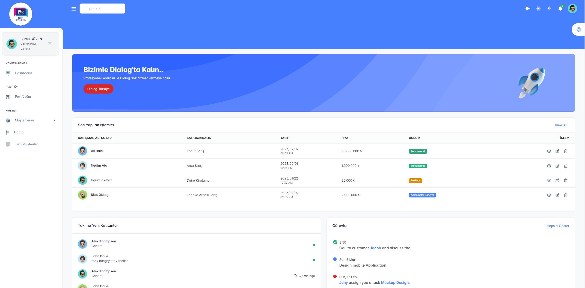
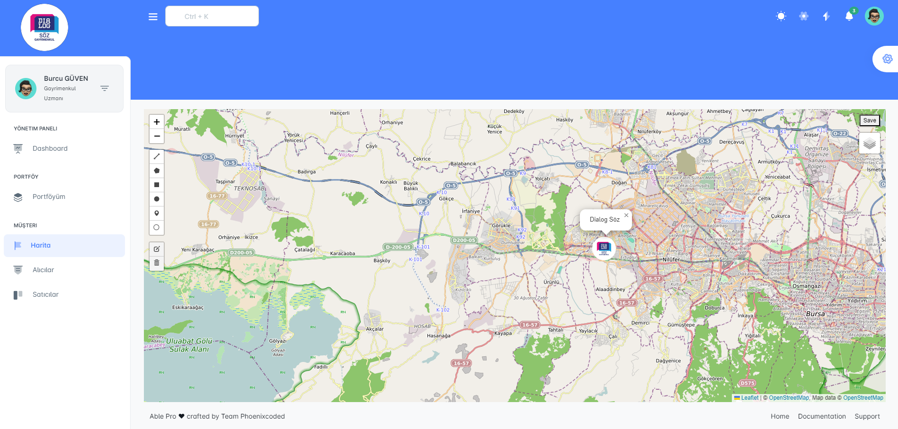
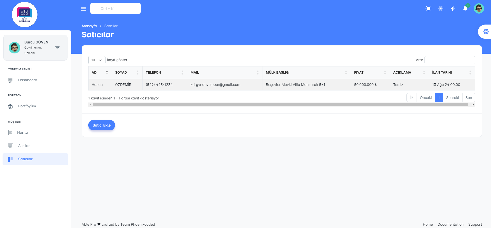

# Gayrimenkul Yönetim Sistemi

Bu proje, gayrimenkul yönetimi için kapsamlı bir uygulamadır. Projede ASP.NET Core MVC kullanılarak geliştirilmiş ve Entity Framework Core ile PostgreSQL veritabanı kullanılmıştır. 
Ayrıca, kullanıcı doğrulama işlemleri ve veri doğrulama için FluentValidation entegrasyonu yapılmış ve harita yönetimi için Leaflet.js kullanılmıştır.

## Proje Amaçları

- Emlaklar için CRUD (Create, Read, Update, Delete) operasyonlarını yönetmek.
- Kullanıcıların kayıt olması, giriş yapması ve yetkilendirme işlemlerini gerçekleştirmek.
- Emlak portföylerini yönetmek ve çeşitli emlak adreslerini harita üzerinde göstermek.
- Kullanıcı dostu bir arayüz ile emlak bilgilerini görselleştirmek.

## Kullanılan Teknolojiler ve Kütüphaneler

- **ASP.NET Core 8**: MVC tabanlı web uygulaması geliştirmek için kullanılmıştır.
- **Entity Framework Core**: PostgreSQL veritabanı ile ilişkilendirilmiş Code First yaklaşımı kullanılarak veri modellemesi yapılmıştır.
- **Automapper**: Veri transfer nesneleri (DTO'lar) ile veri modelleri arasında dönüşüm yapmak için kullanılmıştır.
- **FluentValidation**: DTO nesneleri için doğrulama kuralları tanımlamak için kullanılmıştır.
- **Leaflet.js**: Emlak konumlarını harita üzerinde görselleştirmek için kullanılmıştır.

## Proje Özellikleri

- **Kullanıcı Yönetimi**: Kayıt, giriş ve yetkilendirme işlemleri.
- **Emlak Yönetimi**: Emlak bilgilerini ekleme, güncelleme, silme ve listeleme.
- **Adres Yönetimi**: Emlakların adres bilgilerini yönetme ve harita üzerinde gösterme.
- **Harita Görselleştirme**: Leaflet.js kullanarak emlak konumlarını harita üzerinde gösterme.
- **Veri Doğrulama**: FluentValidation ile veri doğrulama kurallarını uygulama.

## Resimler

